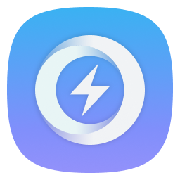
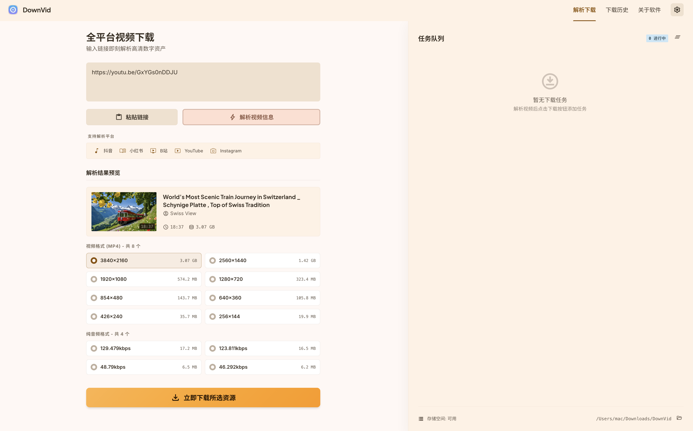
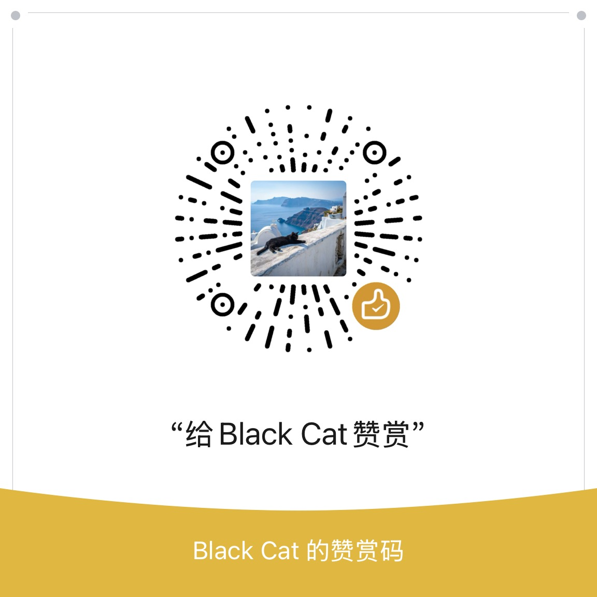

<div align="center">

<table>
  <tr>
    <td width="110" align="center">
      
    </td>
    <td>
      <h1>DownVid</h1>
      <p><strong>现代化的开源视频下载工具 — 一键下载全网无水印高清视频</strong></p>
      <p>
        <a href="./LICENSE"></a>
        <a href="https://www.electronjs.org/"></a>
        <a href="https://vuejs.org/"></a>
        <a href="https://www.typescriptlang.org/"></a>
        <a href="https://github.com/yt-dlp/yt-dlp"></a>
        <a href="https://linux.do"></a>
        
      </p>
    </td>
  </tr>
</table>

<br />

<a href="https://github.com/yxxbc/downvid/releases"></a>
<a href="https://github.com/yxxbc/downvid/releases/latest"></a>
<a href="https://github.com/yxxbc/downvid/stargazers"></a>

<br />
<br />



<br />

> 基于 [Videdown](https://github.com/cshuangyy/videdown) by cshuangyy (MIT License) 二次开发

</div>

---

## 📑 目录

- [项目简介](#-项目简介)
- [功能特性](#-功能特性)
- [支持的网站](#-支持的网站)
- [快速开始](#-快速开始)
  - [下载安装](#下载安装)
  - [从源码构建](#从源码构建)
- [技术栈](#-技术栈)
- [项目结构](#-项目结构)
- [贡献指南](#-贡献指南)
- [常见问题](#-常见问题)
- [更新日志](#-更新日志)
- [支持项目](#-支持项目)
- [开源协议](#-开源协议)
- [致谢](#-致谢)

---

## 📖 项目简介

**DownVid** 是一款现代化的开源视频下载工具，让你可以从抖音、小红书、B站、YouTube、Instagram 等网站下载无水印高清视频。

基于 **Electron** 构建跨平台桌面应用，使用 **yt-dlp** 作为下载引擎，DownVid 提供了简洁直观的界面和强大的功能，满足你的所有下载需求。

> ⚠️ DownVid 目前正在积极开发中，欢迎反馈任何 [问题](https://github.com/yxxbc/downvid/issues)。

---

## ✨ 功能特性

### 🌍 全球视频下载支持
通过强大的 yt-dlp 引擎，可以从全球几乎所有网站下载视频。支持 **1000+ 个网站**，包括 YouTube、抖音、B站、小红书、Instagram 等。

### 🎨 一流的界面体验
现代化、简洁的界面，操作直观。一键暂停 / 恢复 / 重试，实时进度追踪，全面的下载队列管理。支持深色 / 浅色主题切换。

### ⚡ 实时下载进度
显示下载进度、下载速度、预计剩余时间，让你随时掌握下载状态。

### 🍪 Cookie 支持
支持导入浏览器 Cookie，可以下载需要登录的视频内容（如 YouTube 会员视频、B站登录态内容）。

### 🎛️ 多格式选择
支持选择不同的视频质量和格式（360p / 480p / 720p / 1080p），包括仅下载音频模式。支持 YouTube 多音轨选择和字幕下载。

### 📥 下载历史记录
自动保存下载历史，方便随时回顾和重新下载。

### 🔄 自动更新
内置 electron-updater 自动更新系统，第一时间获取最新版本。

---

## 🌐 支持的网站

DownVid 通过 yt-dlp 支持 **1000+ 个**视频和音频平台。主要支持：

| 分类 | 平台 |
|------|------|
| 🇨🇳 **国内平台** | 抖音、B站（哔哩哔哩）、小红书、快手、西瓜视频 |
| 🌍 **国际平台** | YouTube、Instagram、TikTok、Twitter/X、Facebook |
| 📦 **其他** | 支持几乎所有 yt-dlp 支持的网站 |

完整支持列表请访问 [yt-dlp 支持网站](https://github.com/yt-dlp/yt-dlp/blob/master/supportedsites.md)。

---

## 🚀 快速开始

### 下载安装

1. 访问 [Releases](https://github.com/yxxbc/downvid/releases) 页面
2. 下载对应平台的最新版本安装程序
   - **macOS**: `.dmg` (ARM64 / x64)
   - **Windows**: `.exe` (x64)
   - **Linux**: `.AppImage` / `.deb` (x64 / ARM64)
3. 运行安装程序，按提示完成安装
4. 安装完成后即可使用

### 从源码构建

#### 环境要求

- [Node.js](https://nodejs.org/) >= 18
- [pnpm](https://pnpm.io/) >= 8
- [Git](https://git-scm.com/)

#### 1. 克隆仓库

```bash
git clone https://github.com/yxxbc/downvid.git
cd downvid
```

#### 2. 下载依赖工具

本项目需要 **yt-dlp** 和 **ffmpeg** 才能正常运行。
但是releases下载的已经封装依赖了，下载即用

**macOS（Homebrew）：**
```bash
brew install yt-dlp ffmpeg
```

**Ubuntu / Debian：**
```bash
sudo apt update
sudo apt install yt-dlp ffmpeg
```

**Windows：**
```bash
# 使用 winget
winget install yt-dlp.yt-dlp Gyan.FFmpeg
```

或者使用项目内置脚本一键下载：
```bash
# 自动检测平台并下载
pnpm download-deps

# 指定平台
pnpm download-deps:mac
pnpm download-deps:win
pnpm download-deps:linux
```

#### 3. 安装项目依赖

```bash
pnpm install
```

#### 4. 运行和构建

```bash
# 开发模式运行
pnpm dev

# 构建生产版本（当前平台）
pnpm build

# 构建指定平台
pnpm build:mac      # macOS 通用
pnpm build:mac:arm64  # macOS Apple Silicon
pnpm build:mac:x64    # macOS Intel
pnpm build:win      # Windows
pnpm build:linux    # Linux
```

---

## 🛠️ 技术栈

| 技术 | 用途 |
|------|------|
| [](https://www.electronjs.org/) | 跨平台桌面应用框架 |
| [](https://vuejs.org/) | 渐进式 JavaScript 框架 |
| [](https://www.typescriptlang.org/) | 类型安全的 JavaScript 超集 |
| [](https://tailwindcss.com/) | 实用优先的 CSS 框架 |
| [](https://vitejs.dev/) | 下一代前端构建工具 |
| [](https://pinia.vuejs.org/) | Vue 状态管理 |
| [](https://github.com/yt-dlp/yt-dlp) | 强大的视频下载引擎 |
| [](https://ffmpeg.org/) | 音视频处理工具 |
| [](https://www.electron.build/) | 应用打包与发布 |

---

## 📁 项目结构

```
videdown/
├── bin/                    # 依赖下载脚本
├── electron/               # Electron 主进程代码
│   ├── main.ts            # 主进程入口
│   └── ...                # 模块化拆分
├── src/                    # 渲染进程（Vue 3）
│   ├── assets/            # 静态资源
│   ├── components/        # 组件
│   ├── stores/            # Pinia 状态管理
│   └── ...
├── public/                 # 公共资源
├── dist/                   # Vite 构建输出
├── dist-electron/          # Electron 主进程构建输出
├── release/                # electron-builder 打包输出
├── .github/                # GitHub Actions CI/CD
├── electron-builder.json5  # electron-builder 配置
├── vite.config.ts         # Vite 配置
├── tailwind.config.js     # Tailwind 配置
├── tsconfig.json          # TypeScript 配置
├── package.json           # 项目依赖与脚本
├── CHANGELOG.md           # 更新日志
├── LICENSE                # 开源协议
└── README.md              # 项目说明
```

---

## 🤝 贡献指南

欢迎贡献！请遵循以下步骤：

1. **Fork** 本仓库
2. 创建你的特性分支：`git checkout -b feature/AmazingFeature`
3. 提交你的更改：`git commit -m 'Add some AmazingFeature'`
4. 推送到分支：`git push origin feature/AmazingFeature`
5. 开启一个 **Pull Request**

### 开发规范

- 代码遵循 TypeScript 严格模式
- 使用 ESLint / Prettier 格式化代码
- 提交信息遵循 [Conventional Commits](https://www.conventionalcommits.org/) 规范
- 新增功能请同步更新文档和 CHANGELOG

---

## ❓ 常见问题

### Q: 下载提示缺少 yt-dlp / ffmpeg？
A: 请确保已安装这两个依赖工具。可以使用 `pnpm download-deps` 一键下载，或参考 [从源码构建](#从源码构建) 中的安装方式。

### Q: 为什么有些视频下载失败？
A: 部分平台需要登录才能访问，请在设置中导入浏览器 Cookie。也可能是 yt-dlp 版本过旧，尝试更新到最新版本。

### Q: 支持哪些视频画质？
A: 支持 360p / 480p / 720p / 1080p，具体取决于源平台提供的画质选项。也支持纯音频下载模式。

### Q: macOS 提示"无法打开，因为无法验证开发者"？
A: 右键点击应用，选择"打开"，或在"系统设置 → 隐私与安全性"中点击"仍要打开"。

---

## 📝 更新日志

详细的版本更新记录请查看 [CHANGELOG.md](./CHANGELOG.md)。


### Unreleased
- 🚧 跨平台支持：macOS (ARM64/x64)、Windows (x64)、Linux (x64/ARM64)
- 🚧 自动更新系统 (electron-updater + GitHub Releases)
- 🚧 一键下载依赖脚本 & GitHub Actions CI/CD 自动构建
- 🚧 项目模块化重构

---

## 💖 支持项目

如果 DownVid 对你有帮助，欢迎请作者喝杯咖啡 ☕

<div align="center">
  
  <p><em>微信扫码赞赏 — 给 Black Cat 赞赏</em></p>
</div>

---

## 📄 开源协议

本项目基于 [MIT License](./LICENSE) 协议开源。

基于 [Videdown](https://github.com/cshuangyy/videdown) (MIT License) 修改。

---

## 🙏 致谢

- [Videdown](https://github.com/cshuangyy/videdown) — 原始项目
- [yt-dlp](https://github.com/yt-dlp/yt-dlp) — 强大的视频下载引擎
- [FFmpeg](https://ffmpeg.org/) — 音视频处理解决方案
- [Electron](https://www.electronjs.org/) — 跨平台桌面应用框架
- [Vue.js](https://vuejs.org/) — 渐进式 JavaScript 框架
- [Tailwind CSS](https://tailwindcss.com/) — 实用优先的 CSS 框架
- [Claude Code](https://www.anthropic.com/claude) — AI 编程助手

---

## 🔗 友链

- [LinuxDo](https://linux.do) — 高质量的 Linux 中文社区

---

<div align="center">

如果这个项目对你有帮助，欢迎给个 ⭐ Star 支持一下！

Made with ❤️ by DownVid Team

</div>
